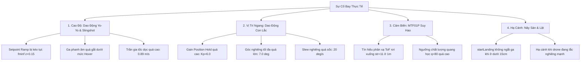

# BÁO CÁO TỔNG HỢP & PHÂN TÍCH TOÀN DIỆN CÁC LẦN BAY THỰC TẾ
## Dự Án: `drone_alt_hold_1m` (ESP32 + MPU6050 + BMP388 + MTF01P + 4x ESC)

---

## 1. GIỚI THIỆU & CẤU HÌNH HỆ THỐNG

Tài liệu này phân tích các log của firmware lịch sử có mục tiêu 1,00 m. Firmware
hiện tại tự động cất cánh và giữ độ cao 0,50 m, đồng thời giữ vị trí ngang tại
điểm calib bằng cảm biến quang học.

### Cấu hình phần cứng:
- **MCU**: ESP32 (Sample rate điều khiển: 200 Hz).
- **IMU**: MPU6050 (Gia tốc kế + Con quay hồi chuyển) trên bus I2C chính (`SDA=32, SCL=33`).
- **Cảm biến khí áp**: BMP388 trên bus I2C phụ (`SDA=21, SCL=22`).
- **Cảm biến quang học & ToF**: MicoAir MTF-01P (Gồm cảm biến đo khoảng cách bằng laser ToF và camera Optical Flow) giao tiếp UART1 (`TX->GPIO19, RX->GPIO23`, baud 115200, giao thức Micolink).
- **Động cơ & ESC**: 4 động cơ không chổi than điều khiển bằng tín hiệu PWM tiêu chuẩn 1000–2000 µs qua LEDC ESP32.
  - M1 (Front-Left, CW) = GPIO 26
  - M2 (Front-Right, CCW) = GPIO 13
  - M3 (Back-Right, CW) = GPIO 14
  - M4 (Back-Left, CCW) = GPIO 27

---

## 2. BẢNG TỔNG HỢP DIỄN BIẾN CÁC LẦN THỬ NGHIỆM BAY

| Lần bay | Thời điểm log | Độ cao Max ($z_{\max}$) | Hiện tượng thực tế | Nguyên nhân cốt lõi | Trạng thái kết thúc |
|:---:|:---:|:---:|:---|:---|:---:|
| **1** | 00:15:45 | **0.30 m** | Drone không cất cánh nổi, chỉ nhấc nhẹ rồi kẹt sát sàn, sau đó tự ngắt động cơ. | Ga treo sàn (`HOVER=1400`) quá thấp; M1 chạm trần mixer (`1610us`) kéo sập ga chung; Giới hạn bù ga (`+80us`) quá hẹp. | Failsafe: `khong phat hien roi dat` |
| **2** | 00:26:50 | **0.60 m** | Drone lên được 0.6m nhưng lảo đảo, trôi mạnh sang phải ($+0.81\text{m}$), sau đó rơi xuống. | Ga phanh quá sớm khi leo $>0.3\text{m/s}$; Optical Flow bị ngắt do đặt ngưỡng chất lượng $q \ge 80$ quá khắt khe. | Failsafe: `khong phat hien roi dat` |
| **3** | 00:39:23 | **1.03 m** | Lên tới 1.03m với tốc độ quá lớn ($+0.6\text{m/s}$), cắt ga tụt xuống sàn rồi bất ngờ phóng vọt ngược lên 1.14m! | Lên đỉnh bị quá đà; Khi chạm đất ở Failsafe, ga vẫn giữ mức $1580\,\mu\text{s}$ (bug nảy sàn) khiến drone bay vọt lên. | Failsafe: `roi xuong khi cat canh` |
| **4** | 01:01:06 | **1.38 m** | Drone phóng vọt từ 0.6m lên thẳng 1.38m như tên bắn, sau đó mất kiểm soát rơi cắm sàn. | **Hiệu ứng dây thun (Slingshot)**: Drone bị trễ dưới sàn trong khi Setpoint đã chạy tít lên 1.0m, gây tích lũy sai số khổng lồ. | Disarmed: `failsafe ground impact` |
| **5** | 01:10:57 | **0.99 m** | **Dao động Yo-Yo liên tục ($0.08\text{m} \leftrightarrow 0.95\text{m}$)** và lắc ngang như con lắc; bấm LAND thì lộn nhào. | **Bug kéo tụt Setpoint** (`fminf(z+0.15, sp)`) tạo cộng hưởng Yo-Yo; Gain Position Hold quá gắt ($7^\circ, K_p=6$) gây lắc con lắc. | Tripped: `Sai so goc qua lon` (Lộn nhào) |

---

## 3. CHI TIẾT DỮ LIỆU LOG & PHÂN TÍCH TỪNG LẦN BAY

### Ý nghĩa các thông số trong Log:
- `z`: Cao độ ước lượng hiện tại (mét) | `sp`: Cao độ mục tiêu Setpoint (mét).
- `vz`: Vận tốc thẳng đứng (m/s, dương là đang leo lên, âm là đang rơi xuống).
- `src`: Nguồn dữ liệu cao độ (`FUSED`: Hợp nhất ToF + Baro, `MTF`: ToF laser, `BMP`: Áp kế).
- `corr`: Lượng vi chỉnh ga từ bộ điều khiển PID cao độ ($\mu\text{s}$).
- `P, R`: Góc Pitch (nghiêng trước/sau) và Roll (nghiêng trái/phải) thực tế (độ).
- `T`: Tổng ga cơ sở cấp vào Mixer ($\mu\text{s}$) | `H`: Giá trị ga treo dự kiến `HOVER_THROTTLE` ($\mu\text{s}$).
- `M`: Xung PWM xuất ra 4 ESC: `M1/M2/M3/M4` ($\mu\text{s}$).
- `rangeAge / baroAge`: Độ trễ của dữ liệu khoảng cách laser và khí áp (ms).
- `str`: Cường độ tín hiệu phản hồi laser ToF (0–255; $>100$ là rất tốt, $<30$ là tín hiệu yếu/suy hao).
- `FLOW`: Trạng thái quang học (`FLOW=OK` hoặc `FLOW=--` bị mất).
- `q`: Chất lượng ảnh quang học (0–255).
- `vFR`: Vận tốc di chuyển ngang Forward / Right do Optical Flow tính toán (m/s).
- `posFR`: Tọa độ vị trí ngang trôi dạt Forward / Right (mét).
- `tiltPR`: Góc bù nghiêng Pitch / Roll mà Position Hold yêu cầu để ghìm drone (độ).

---

### 3.1. LẦN BAY 1 (00:15:45) - THIẾU LỰC NÂNG, KẸT SÁT SÀN

#### Dữ liệu Log thô:
```text
00:15:45.576 -> [TAKEOFF] z=+0.104m sp=0.516m vz=+0.034m/s src=FUSED corr=+49us | P=+1.5 R=-1.3 T=1449 H=1400 M=1565/1341/1457/1434 | rangeAge=5ms baroAge=21ms str=255 | FLOW=OK q=110 age=5ms vFR=+0.00/+0.00 posFR=+0.00/+0.00 tiltPR=+0.0/+0.0 | tu cat canh den 1.0
00:15:46.069 -> [TAKEOFF] z=+0.266m sp=0.666m vz=+0.164m/s src=FUSED corr=+33us | P=+1.6 R=-1.7 T=1433 H=1400 M=1610/1173/1334/1537 | rangeAge=2ms baroAge=17ms str=243 | FLOW=OK q=92 age=2ms vFR=+0.30/+0.00 posFR=+0.04/+0.00 tiltPR=+0.7/+0.0 | tu cat canh den 1.0
00:15:46.576 -> [TAKEOFF] z=+0.301m sp=0.791m vz=+0.095m/s src=FUSED corr=+46us | P=+2.1 R=-1.2 T=1446 H=1400 M=1542/1311/1495/1438 | rangeAge=4ms baroAge=11ms str=217 | FLOW=OK q=86 age=4ms vFR=+0.44/+0.00 posFR=+0.23/+0.01 tiltPR=+1.0/+0.0 | tu cat canh den 1.0
00:15:47.062 -> [TAKEOFF] z=+0.263m sp=0.891m vz=+0.013m/s src=FUSED corr=+61us | P=+1.9 R=-2.3 T=1461 H=1400 M=1610/1098/1263/1458 | rangeAge=4ms baroAge=21ms str=255 | FLOW=OK q=91 age=4ms vFR=+0.53/+0.06 posFR=+0.42/+0.02 tiltPR=+1.5/-0.1 | tu cat canh den 1.0
00:15:47.580 -> [TAKEOFF] z=+0.163m sp=1.000m vz=-0.143m/s src=FUSED corr=+80us | P=+2.0 R=-0.4 T=1480 H=1400 M=1610/1354/1495/1439 | rangeAge=0ms baroAge=21ms str=255 | FLOW=OK q=96 age=0ms vFR=+0.67/+0.22 posFR=+0.79/+0.10 tiltPR=+1.8/-0.7 | tu cat canh den 1.0
00:15:48.094 -> [FAILSAFE] z=+0.139m sp=0.129m vz=-0.068m/s src=FUSED corr=+29us | P=+1.3 R=-0.2 T=1472 H=1400 M=1554/1393/1468/1474 | rangeAge=9ms baroAge=21ms str=255 | FLOW=OK q=90 age=9ms vFR=+0.31/+0.23 posFR=+0.99/+0.21 tiltPR=+1.3/-0.7 | khong phat hien roi
00:15:48.564 -> [FAILSAFE] z=+0.192m sp=0.109m vz=+0.049m/s src=FUSED corr=+3us | P=+2.4 R=+1.9 T=1464 H=1400 M=1393/1528/1542/1396 | rangeAge=1ms baroAge=8ms str=255 | FLOW=OK q=81 age=1ms vFR=-0.07/+0.23 posFR=+0.00/+0.00 tiltPR=+0.0/+0.0 | khong phat hien roi
00:15:49.076 -> [FAILSAFE] z=+0.230m sp=0.084m vz=+0.078m/s src=FUSED corr=-13us | P=+2.2 R=+2.1 T=1454 H=1400 M=1395/1452/1573/1399 | rangeAge=5ms baroAge=12ms str=255 | FLOW=-- q=72 age=243ms vFR=+0.00/+0.00 posFR=+0.00/+0.00 tiltPR=+0.0/+0.0 | khong phat hien roi
00:15:49.582 -> [FAILSAFE] z=+0.209m sp=0.054m vz=-0.004m/s src=FUSED corr=-6us | P=+1.5 R=+0.5 T=1442 H=1400 M=1538/1297/1455/1479 | rangeAge=7ms baroAge=21ms str=255 | FLOW=OK q=85 age=7ms vFR=-0.10/+0.26 posFR=+0.00/+0.00 tiltPR=+0.0/+0.0 | khong phat hien roi
00:15:50.106 -> [FAILSAFE] z=+0.101m sp=0.029m vz=-0.128m/s src=FUSED corr=+21us | P=+2.3 R=+1.7 T=1432 H=1400 M=1379/1505/1565/1281 | rangeAge=6ms baroAge=21ms str=255 | FLOW=OK q=96 age=6ms vFR=+0.09/+0.00 posFR=+0.00/+0.00 tiltPR=+0.0/+0.0 | khong phat hien roi
```

#### Phân tích hiện tượng:
1. **Thiếu lực nâng nghiêm trọng**: `HOVER_THROTTLE = 1400` không đủ để drone thoát hiệu ứng mặt đất (Ground Effect). Drone chỉ ngoi lên được $z = 0.301\text{m}$ ở giây `46.576`.
2. **Bão hòa động cơ 1 (Mixer Saturation)**: Tại giây `46.069` và `47.062`, động cơ `M1` chạm trần `1610 µs` (`M=1610/1173/1334/1537`). Thuật toán Mixer bảo toàn góc quay đã kéo ga tổng thể xuống để chống lật, khiến drone bị hụt tổng lực nâng.
3. **Kẹt trần bù ga**: `corr = +80us` chạm đúng trần bù ga trên `ALT_CORRECTION_UP_US = 80us`. Drone không thể bơm thêm ga dù đang chìm dần (`vz = -0.143 m/s`).
4. **Kích hoạt Failsafe**: Sau 4 giây, độ cao vẫn $< 0.20\text{m}$, máy bay tự kích hoạt Failsafe hạ cánh khẩn cấp vì tưởng kẹt sàn.

---

### 3.2. LẦN BAY 2 (00:26:50) - LÊN 0.6M RỒI MẤT GIỮ VỊ TRÍ, TRÔI DẠT SANG PHẢI

#### Dữ liệu Log thô:
```text
00:26:50.508 -> [TAKEOFF] z=+0.026m sp=0.026m vz=+0.006m/s src=FUSED corr=+0us | P=+0.0 R=-0.0 T=1351 H=1430 M=1348/1350/1353/1352 | rangeAge=1ms baroAge=21ms str=255 | FLOW=OK q=126 age=1ms vFR=+0.00/+0.00 posFR=+0.00/+0.00 tiltPR=+0.0/+0.0 | tu cat canh den 1.0
00:26:51.536 -> [TAKEOFF] z=+0.048m sp=0.048m vz=+0.043m/s src=FUSED corr=+0us | P=+0.4 R=-0.2 T=1391 H=1430 M=1402/1394/1427/1341 | rangeAge=3ms baroAge=20ms str=255 | FLOW=OK q=129 age=3ms vFR=+0.03/+0.00 posFR=+0.00/+0.00 tiltPR=+0.0/+0.0 | tu cat canh den 1.0
00:26:52.491 -> [TAKEOFF] z=+0.060m sp=0.064m vz=+0.050m/s src=FUSED corr=-6us | P=+1.1 R=-1.1 T=1428 H=1430 M=1497/1351/1422/1442 | rangeAge=1ms baroAge=8ms str=255 | FLOW=OK q=126 age=1ms vFR=+0.07/+0.03 posFR=+0.00/+0.00 tiltPR=+0.0/+0.0 | tu cat canh den 1.0
00:26:54.033 -> [TAKEOFF] z=+0.219m sp=0.439m vz=+0.196m/s src=FUSED corr=+3us | P=+0.9 R=-0.7 T=1433 H=1430 M=1403/1488/1578/1263 | rangeAge=6ms baroAge=13ms str=247 | FLOW=OK q=108 age=6ms vFR=-0.04/+0.45 posFR=+0.00/+0.00 tiltPR=+0.0/+0.0 | tu cat canh den 1.0
00:26:54.486 -> [TAKEOFF] z=+0.318m sp=0.564m vz=+0.186m/s src=FUSED corr=+5us | P=-0.8 R=-0.4 T=1435 H=1430 M=1464/1406/1513/1358 | rangeAge=5ms baroAge=18ms str=224 | FLOW=OK q=92 age=5ms vFR=+0.06/+0.57 posFR=-0.00/+0.17 tiltPR=+0.1/-1.5 | tu cat canh den 1.0
00:26:55.026 -> [TAKEOFF] z=+0.280m sp=0.689m vz=+0.019m/s src=FUSED corr=+46us | P=-0.2 R=-2.1 T=1470 H=1430 M=1593/1308/1478/1503 | rangeAge=2ms baroAge=21ms str=255 | FLOW=OK q=97 age=2ms vFR=+0.05/+0.68 posFR=+0.03/+0.49 tiltPR=+0.2/-1.9 | tu cat canh den 1.0
00:26:55.501 -> [TAKEOFF] z=+0.174m sp=0.814m vz=-0.105m/s src=FUSED corr=+67us | P=-0.3 R=-1.4 T=1497 H=1430 M=1466/1504/1645/1354 | rangeAge=8ms baroAge=8ms str=157 | FLOW=OK q=93 age=8ms vFR=-0.12/+0.66 posFR=-0.01/+0.81 tiltPR=-0.3/-1.6 | tu cat canh den 1.0
00:26:55.986 -> [TAKEOFF] z=+0.314m sp=0.939m vz=+0.134m/s src=FUSED corr=+34us | P=-0.1 R=-2.4 T=1469 H=1430 M=1645/1083/1199/1483 | rangeAge=5ms baroAge=12ms str=95 | FLOW=-- q=66 age=127ms vFR=+0.00/+0.00 posFR=+0.00/+0.00 tiltPR=+0.0/+0.0 | tu cat canh den 1.0
00:26:56.504 -> [TAKEOFF] z=+0.609m sp=1.000m vz=+0.469m/s src=FUSED corr=-17us | P=+3.4 R=-0.5 T=1424 H=1430 M=1436/1321/1549/1392 | rangeAge=2ms baroAge=9ms str=28 | FLOW=-- q=60 age=632ms vFR=+0.00/+0.00 posFR=+0.00/+0.00 tiltPR=+0.0/+0.0 | tu cat canh den 1.0
00:26:57.005 -> [TAKEOFF] z=+0.575m sp=1.000m vz=+0.178m/s src=FUSED corr=+25us | P=+2.1 R=+0.0 T=1450 H=1430 M=1467/1439/1535/1361 | rangeAge=4ms baroAge=13ms str=118 | FLOW=-- q=56 age=1132ms vFR=+0.00/+0.00 posFR=+0.00/+0.00 tiltPR=+0.0/+0.0 | tu cat canh den 1.0
00:26:57.506 -> [TAKEOFF] z=+0.345m sp=1.000m vz=-0.238m/s src=FUSED corr=+88us | P=+5.0 R=-2.7 T=1487 H=1430 M=1627/1367/1549/1416 | rangeAge=5ms baroAge=18ms str=255 | FLOW=-- q=52 age=1632ms vFR=+0.00/+0.00 posFR=+0.00/+0.00 tiltPR=+0.0/+0.0 | tu cat canh den 1.0
00:26:58.021 -> [FAILSAFE] z=+0.064m sp=0.137m vz=-0.483m/s src=FUSED corr=+88us | P=+2.0 R=-1.4 T=1509 H=1430 M=1628/1355/1603/1452 | rangeAge=3ms baroAge=21ms str=255 | FLOW=OK q=84 age=3ms vFR=-0.03/-0.02 posFR=+0.00/+0.00 tiltPR=+0.0/+0.0 | khong phat hien roi
00:26:58.507 -> [FAILSAFE] z=+0.134m sp=0.112m vz=-0.074m/s src=FUSED corr=+18us | P=+4.8 R=-2.8 T=1498 H=1430 M=1577/1385/1637/1402 | rangeAge=0ms baroAge=18ms str=244 | FLOW=-- q=55 age=469ms vFR=+0.00/+0.00 posFR=+0.00/+0.00 tiltPR=+0.0/+0.0 | khong phat hien roi
```

#### Phân tích hiện tượng:
1. **Cải thiện độ cao ban đầu**: Đã nâng `HOVER_THROTTLE = 1430`, drone leo thành công lên $z = 0.609\text{m}$.
2. **Trôi ngang cực mạnh sang phải**:
   - Vận tốc dạt phải tăng vọt từ $v_{\text{Right}} = +0.45\text{ m/s} \to +0.68\text{ m/s}$.
   - Tọa độ dạt phải đạt tới $posFR = +0.81\text{m}$ (trôi gần 1 mét sang phải).
3. **Mất tín hiệu Optical Flow đột ngột**:
   - Khi lên cao trên $0.3\text{m}$, chất lượng ảnh `q` rớt xuống 66, 60, 56. Do mã nguồn đặt ngưỡng cứng `FLOW_MIN_QUALITY = 80`, hệ thống coi như mất Flow (`FLOW=--`).
   - Drone mất hoàn toàn khả năng tự ghìm vị trí, trôi tự do trong phòng.
4. **Hiện tượng tụt laser ToF**: Tại độ cao $0.609\text{m}$, cường độ tia phản xạ ToF rơi mạnh từ 255 xuống chỉ còn `str = 28`.

---

### 3.3. LẦN BAY 3 (00:39:23) - VỌT LÊN 1.03M, RƠI TỰ DO & BUG NẢY SÀN TRONG FAILSAFE

#### Dữ liệu Log thô:
```text
00:39:23.507 -> [TAKEOFF] z=+0.296m sp=0.893m vz=-0.008m/s src=FUSED corr=+75us | P=+2.4 R=+0.2 T=1505 H=1430 M=1605/1427/1544/1447 | rangeAge=5ms baroAge=12ms str=255 | FLOW=OK q=102 age=5ms vFR=+0.71/+0.49 posFR=+0.58/-0.01 tiltPR=+4.2/-1.9 | tu cat canh den 1.0
00:39:23.968 -> [TAKEOFF] z=+0.384m sp=1.000m vz=+0.105m/s src=FUSED corr=+71us | P=+0.3 R=-1.6 T=1501 H=1430 M=1613/1421/1641/1330 | rangeAge=3ms baroAge=21ms str=101 | FLOW=-- q=79 age=80ms vFR=+0.00/+0.00 posFR=+0.00/+0.00 tiltPR=+0.4/-0.1 | tu cat canh den 1.0
00:39:24.513 -> [TAKEOFF] z=+0.712m sp=1.000m vz=+0.472m/s src=FUSED corr=+17us | P=-0.2 R=-0.6 T=1453 H=1430 M=1465/1380/1780/1141 | rangeAge=8ms baroAge=21ms str=41 | FLOW=-- q=74 age=108ms vFR=+0.00/+0.00 posFR=+0.00/+0.00 tiltPR=+0.0/+0.0 | tu cat canh den 1.0
00:39:24.991 -> [TAKEOFF] z=+1.031m sp=1.000m vz=+0.595m/s src=FUSED corr=-19us | P=+0.0 R=+2.0 T=1411 H=1430 M=1512/1209/1698/1227 | rangeAge=2ms baroAge=9ms str=27 | FLOW=-- q=36 age=614ms vFR=+0.00/+0.00 posFR=+0.00/+0.00 tiltPR=+0.0/+0.0 | tu cat canh den 1.0
00:39:25.485 -> [TAKEOFF] z=+0.971m sp=1.000m vz=+0.124m/s src=FUSED corr=+12us | P=+2.4 R=+3.7 T=1442 H=1430 M=1435/1324/1780/1121 | rangeAge=6ms baroAge=15ms str=43 | FLOW=-- q=30 age=1114ms vFR=+0.00/+0.00 posFR=+0.00/+0.00 tiltPR=+0.0/+0.0 | tu cat canh den 1.0
00:39:25.990 -> [TAKEOFF] z=+0.558m sp=1.000m vz=-0.510m/s src=FUSED corr=+107us | P=-8.3 R=+11.1 T=1525 H=1430 M=1517/1467/1780/1101 | rangeAge=6ms baroAge=21ms str=190 | FLOW=-- q=48 age=1616ms vFR=+0.00/+0.00 posFR=+0.00/+0.00 tiltPR=+0.0/+0.0 | tu cat canh den 1.0
00:39:26.469 -> [FAILSAFE] z=+0.094m sp=0.141m vz=-0.790m/s src=FUSED corr=+108us | P=+18.0 R=-16.8 T=1580 H=1430 M=1780/1354/1700/1125 | rangeAge=5ms baroAge=21ms str=246 | FLOW=-- q=73 age=102ms vFR=+0.00/+0.00 posFR=+0.00/+0.00 tiltPR=+0.0/+0.0 | roi xuong khi cat c
00:39:27.013 -> [FAILSAFE] z=+0.219m sp=0.116m vz=-0.055m/s src=FUSED corr=+15us | P=-0.0 R=-3.6 T=1570 H=1430 M=1392/1378/1780/1110 | rangeAge=1ms baroAge=21ms str=246 | FLOW=-- q=69 age=597ms vFR=+0.00/+0.00 posFR=+0.00/+0.00 tiltPR=+0.0/+0.0 | roi xuong khi cat c
00:39:27.476 -> [FAILSAFE] z=+0.297m sp=0.091m vz=+0.145m/s src=MTF corr=-22us | P=+0.3 R=+5.5 T=1560 H=1430 M=1622/1486/1780/1358 | rangeAge=3ms baroAge=10ms str=150 | FLOW=-- q=73 age=1102ms vFR=+0.00/+0.00 posFR=+0.00/+0.00 tiltPR=+0.0/+0.0 | roi xuong khi cat c
00:39:28.012 -> [FAILSAFE] z=+0.594m sp=0.040m vz=+0.425m/s src=FUSED corr=-72us | P=+1.1 R=-11.2 T=1541 H=1430 M=1535/1256/1780/1089 | rangeAge=7ms baroAge=15ms str=62 | FLOW=-- q=78 age=44ms vFR=+0.00/+0.00 posFR=+0.00/+0.00 tiltPR=+0.0/+0.0 | roi xuong khi cat c
00:39:28.512 -> [FAILSAFE] z=+0.685m sp=0.000m vz=+0.171m/s src=FUSED corr=-46us | P=+5.4 R=-1.8 T=1519 H=1430 M=1651/1378/1586/1472 | rangeAge=5ms baroAge=21ms str=44 | FLOW=-- q=69 age=155ms vFR=+0.00/+0.00 posFR=+0.00/+0.00 tiltPR=+0.0/+0.0 | roi xuong khi cat c
00:39:28.976 -> [FAILSAFE] z=+0.898m sp=0.000m vz=+0.307m/s src=FUSED corr=-61us | P=+0.5 R=-0.3 T=1496 H=1430 M=1640/1386/1476/1482 | rangeAge=7ms baroAge=14ms str=32 | FLOW=-- q=57 age=687ms vFR=+0.00/+0.00 posFR=+0.00/+0.00 tiltPR=+0.0/+0.0 | roi xuong khi cat c
00:39:29.516 -> [FAILSAFE] z=+0.929m sp=0.000m vz=+0.223m/s src=FUSED corr=-52us | P=-0.2 R=-0.6 T=1474 H=1430 M=1444/1468/1563/1421 | rangeAge=1ms baroAge=21ms str=22 | FLOW=-- q=55 age=1189ms vFR=+0.00/+0.00 posFR=+0.00/+0.00 tiltPR=+0.0/+0.0 | roi xuong khi cat c
00:39:30.005 -> [FAILSAFE] z=+1.142m sp=0.000m vz=+0.334m/s src=FUSED corr=-64us | P=-0.1 R=-1.2 T=1451 H=1430 M=1458/1426/1507/1413 | rangeAge=12ms baroAge=0ms str=26 | FLOW=-- q=36 age=1690ms vFR=+0.00/+0.00 posFR=+0.00/+0.00 tiltPR=+0.0/+0.0 | roi xuong khi cat c
```

#### Phân tích hiện tượng:
1. **Chạm mốc 1 mét nhưng quán tính leo quá lớn**:
   - Ở giây `24.991`, drone chạm $z = 1.031\text{m}$, nhưng vận tốc thẳng đứng vẫn đạt tới $+0.595\text{ m/s}$. Drone vọt lố qua mục tiêu.
2. **Cắt ga đột ngột gây hẫng lực nâng**:
   - Bộ điều khiển thấy $z > 1.0\text{m}$ liền lập tức giảm ga xuống $T = 1411\,\mu\text{s}$ (dưới mức ga treo $1430\,\mu\text{s}$) và kéo theo `corr = -19us`.
   - Vận tốc rơi tự do đạt đỉnh $v_z = -0.790\text{ m/s}$, drone rơi tự do đập xuống sàn ở $z = 0.094\text{m}$.
3. **Phát hiện Bug nghiêm trọng trong Failsafe (Nảy sàn)**:
   - Khi chạm đất ở giây `26.469` ($z = 0.094\text{m}$), Failsafe được kích hoạt với lý do `"roi xuong khi cat canh"`.
   - Tuy nhiên hàm `startLanding()` lúc đó **vẫn giữ ga ở mức $1580\,\mu\text{s}$** và chỉ giảm từ từ với tốc độ $20\,\mu\text{s/s}$.
   - Kết quả: Khi vừa chạm sàn nảy lên, mức ga $1580\,\mu\text{s}$ làm drone **bắn vọt ngược trở lại trần nhà lên tận $1.142\text{m}$ ngay trong chế độ FAILSAFE!**

---

### 3.4. LẦN BAY 4 (01:01:06) - HIỆN TƯỢNG "DÂY THUN" (SLINGSHOT) VỌT LÊN 1.38M

#### Dữ liệu Log thô:
```text
01:01:06.552 -> [TAKEOFF] z=+0.252m sp=0.643m vz=-0.092m/s src=FUSED corr=+48us | P=+1.3 R=-1.8 T=1478 H=1430 M=1422/1500/1633/1358 | rangeAge=4ms baroAge=15ms str=129 | FLOW=OK q=120 age=4ms vFR=+0.21/+0.08 posFR=+0.00/+0.00 tiltPR=+0.4/+0.0 | tu cat canh den 1.0
01:01:07.031 -> [TAKEOFF] z=+0.174m sp=0.769m vz=-0.107m/s src=FUSED corr=+66us | P=+3.5 R=-2.6 T=1496 H=1430 M=1470/1495/1632/1393 | rangeAge=6ms baroAge=21ms str=76 | FLOW=OK q=101 age=6ms vFR=+0.28/+0.00 posFR=+0.00/+0.00 tiltPR=+0.0/+0.0 | tu cat canh den 1.0
01:01:07.539 -> [TAKEOFF] z=+0.647m sp=0.894m vz=+0.555m/s src=FUSED corr=-25us | P=+4.3 R=-1.8 T=1459 H=1430 M=1486/1369/1557/1431 | rangeAge=9ms baroAge=6ms str=19 | FLOW=OK q=90 age=9ms vFR=+0.32/-0.52 posFR=+0.03/-0.07 tiltPR=+1.1/+1.9 | tu cat canh den 1.0
01:01:08.026 -> [TAKEOFF] z=+1.216m sp=1.000m vz=+0.893m/s src=FUSED corr=-100us | P=+3.9 R=+0.7 T=1409 H=1430 M=1473/1342/1465/1360 | rangeAge=0ms baroAge=13ms str=11 | FLOW=OK q=85 age=0ms vFR=+0.44/-0.81 posFR=+0.19/-0.42 tiltPR=+1.5/+2.5 | tu cat canh den 1.0
01:01:08.514 -> [TAKEOFF] z=+1.388m sp=1.000m vz=+0.515m/s src=FUSED corr=-89us | P=+3.1 R=+2.5 T=1395 H=1430 M=1375/1385/1531/1292 | rangeAge=1ms baroAge=19ms str=15 | FLOW=OK q=85 age=1ms vFR=+0.64/-0.48 posFR=+0.46/-0.75 tiltPR=+2.5/+2.4 | tu cat canh den 1.0
01:01:09.032 -> [TAKEOFF] z=+1.164m sp=1.000m vz=-0.089m/s src=FUSED corr=-20us | P=+3.2 R=+3.5 T=1409 H=1430 M=1444/1377/1491/1330 | rangeAge=8ms baroAge=21ms str=30 | FLOW=OK q=91 age=8ms vFR=+0.83/-0.14 posFR=+0.83/-0.89 tiltPR=+3.1/+2.0 | tu cat canh den 1.0
01:01:09.514 -> [TAKEOFF] z=+0.570m sp=1.000m vz=-0.779m/s src=FUSED corr=+91us | P=+4.8 R=+7.2 T=1498 H=1430 M=1529/1428/1458/1600 | rangeAge=6ms baroAge=20ms str=255 | FLOW=OK q=100 age=6ms vFR=+0.54/+0.00 posFR=+1.19/-0.85 tiltPR=+3.9/+2.2 | tu cat canh den 1.0
01:01:10.034 -> [DISARMED] z=+0.033m sp=0.000m vz=-0.967m/s src=FUSED corr=+131us | P=+1.3 R=+16.4 T=1050 H=1430 M=1000/1000/1000/1000 | rangeAge=1ms baroAge=21ms str=255 | FLOW=OK q=117 age=1ms vFR=-0.66/-0.22 posFR=+0.00/+0.00 tiltPR=+0.0/+0.0 | failsafe ground imp
01:01:10.552 -> [DISARMED]
```

#### Phân tích hiện tượng:
1. **Bản chất hiện tượng "Dây thun" (Slingshot Effect)**:
   - Tại giây `07.031`, drone bị dính sàn ở $z = 0.174\text{m}$, trong khi `altitudeSetpointM` chạy độc lập theo thời gian đã vọt lên $sp = 0.769\text{m}$.
   - Độ lệch cao độ tích lũy lên tới $0.60\text{m}$! Thành phần tích phân $I$ và sai số vị trí bơm ga lên tới $T = 1496\,\mu\text{s}$.
   - Khi lực nâng thắng được ma sát sàn, drone bị "bắn như súng cao su" thẳng lên trời với gia tốc cực lớn:
     - Giây `07.031`: $z = 0.174\text{m}$
     - Giây `07.539`: $z = 0.647\text{m}$ (vận tốc $+0.555\text{ m/s}$)
     - Giây `08.026`: $z = 1.216\text{m}$ (vận tốc chạm mốc $+0.893\text{ m/s}$!)
     - Giây `08.514`: Đạt đỉnh ở $z = 1.388\text{m}$!
2. **Cắt ga và rơi cắm sàn**: Tại đỉnh $1.388\text{m}$, bộ điều khiển triệt tiêu ga hết mức (`corr = -89us`, $T=1395\mu\text{s}$). Drone rơi tự do với vận tốc $v_z = -0.967\text{ m/s}$ đập mạnh xuống sàn ($z = 0.033\text{m}$) và bị ngắt khẩn cấp (`failsafe ground impact`).
3. **Cường độ ToF suy hao cực mạnh**: Ở $1.2\text{m} - 1.38\text{m}$, chỉ số `str` tụt xuống mức nguy hiểm: `str = 11` và `str = 15`.

---

### 3.5. LẦN BAY 5 (01:10:57) - DAO ĐỘNG CỘNG HƯỞNG YO-YO & DAO ĐỘNG CON LẮC NGANG

#### Dữ liệu Log thô:
```text
01:10:57.934 -> [TAKEOFF] z=+0.446m sp=0.596m vz=+0.011m/s src=FUSED corr=+4us | P=+1.0 R=-2.4 T=1434 H=1430 M=1593/1284/1360/1500 | rangeAge=12ms baroAge=0ms str=41 | FLOW=OK q=93 age=12ms vFR=+0.00/+0.21 posFR=+0.05/+0.52 tiltPR=+1.2/-4.4 | tu cat canh den 1.0
01:10:58.420 -> [TAKEOFF] z=+0.439m sp=0.589m vz=-0.002m/s src=FUSED corr=+8us | P=+2.8 R=-2.5 T=1438 H=1430 M=1394/1442/1609/1311 | rangeAge=2ms baroAge=20ms str=95 | FLOW=OK q=100 age=2ms vFR=+0.00/+0.25 posFR=+0.08/+0.64 tiltPR=+1.8/-5.3 | tu cat canh den 1.0
01:10:58.915 -> [TAKEOFF] z=+0.078m sp=0.228m vz=-0.453m/s src=FUSED corr=+50us | P=-3.4 R=-0.3 T=1480 H=1430 M=1523/1416/1588/1396 | rangeAge=8ms baroAge=21ms str=218 | FLOW=OK q=123 age=8ms vFR=+0.19/+0.00 posFR=+0.11/+0.65 tiltPR=+1.4/-4.1 | tu cat canh den 1.0
01:10:59.457 -> [TAKEOFF] z=+0.449m sp=0.348m vz=+0.298m/s src=FUSED corr=-24us | P=+1.3 R=-2.5 T=1433 H=1430 M=1401/1409/1575/1349 | rangeAge=2ms baroAge=9ms str=52 | FLOW=OK q=108 age=2ms vFR=+0.55/-0.34 posFR=+0.35/+0.49 tiltPR=+5.8/-1.3 | tu cat canh den 1.0
01:10:59.930 -> [TAKEOFF] z=+0.814m sp=0.473m vz=+0.583m/s src=FUSED corr=-45us | P=+3.9 R=-0.8 T=1395 H=1430 M=1426/1347/1434/1378 | rangeAge=5ms baroAge=15ms str=44 | FLOW=OK q=99 age=5ms vFR=+0.23/-0.34 posFR=+0.55/+0.31 tiltPR=+5.0/-0.5 | tu cat canh den 1.0
01:11:00.416 -> [TAKEOFF] z=+0.657m sp=0.598m vz=+0.009m/s src=FUSED corr=-9us | P=+3.5 R=-0.8 T=1419 H=1430 M=1476/1350/1426/1427 | rangeAge=0ms baroAge=7ms str=128 | FLOW=OK q=108 age=0ms vFR=+0.25/+0.33 posFR=+0.67/+0.31 tiltPR=+5.8/-4.4 | tu cat canh den 1.0
01:11:00.934 -> [TAKEOFF] z=+0.117m sp=0.267m vz=-0.699m/s src=FUSED corr=+66us | P=-7.6 R=-0.0 T=1496 H=1430 M=1515/1559/1530/1399 | rangeAge=5ms baroAge=12ms str=255 | FLOW=OK q=117 age=5ms vFR=-0.24/-0.20 posFR=+0.69/+0.48 tiltPR=+3.2/-3.0 | tu cat canh den 1.0
01:11:01.454 -> [TAKEOFF] z=+0.327m sp=0.327m vz=+0.042m/s src=FUSED corr=+2us | P=-1.1 R=-0.6 T=1457 H=1430 M=1497/1411/1518/1402 | rangeAge=7ms baroAge=17ms str=73 | FLOW=OK q=106 age=7ms vFR=-0.44/-0.27 posFR=+0.52/+0.26 tiltPR=+1.3/-0.9 | tu cat canh den 1.0
01:11:01.936 -> [TAKEOFF] z=+0.800m sp=0.452m vz=+0.608m/s src=FUSED corr=-45us | P=-0.5 R=+0.1 T=1407 H=1430 M=1395/1402/1521/1310 | rangeAge=8ms baroAge=21ms str=24 | FLOW=OK q=95 age=8ms vFR=-0.38/+0.31 posFR=+0.33/+0.24 tiltPR=+0.9/-4.4 | tu cat canh den 1.0
01:11:02.417 -> [TAKEOFF] z=+0.950m sp=0.577m vz=+0.421m/s src=FUSED corr=-45us | P=-0.4 R=-1.0 T=1395 H=1430 M=1535/1261/1370/1413 | rangeAge=3ms baroAge=21ms str=18 | FLOW=OK q=96 age=3ms vFR=-0.44/+0.13 posFR=+0.11/+0.26 tiltPR=-0.4/-3.2 | tu cat canh den 1.0
01:11:02.923 -> [TAKEOFF] z=+0.460m sp=0.610m vz=-0.458m/s src=FUSED corr=+34us | P=-2.5 R=-3.7 T=1461 H=1430 M=1567/1332/1496/1455 | rangeAge=10ms baroAge=0ms str=127 | FLOW=OK q=106 age=10ms vFR=-0.55/+0.52 posFR=-0.13/+0.40 tiltPR=-2.1/-6.3 | tu cat canh den 1.0
01:11:03.458 -> [TAKEOFF] z=+0.064m sp=0.211m vz=-0.721m/s src=FUSED corr=+67us | P=-10.4 R=+3.8 T=1498 H=1430 M=1520/1468/1682/1360 | rangeAge=1ms baroAge=8ms str=20 | FLOW=OK q=113 age=1ms vFR=+0.38/-0.17 posFR=-0.30/+0.48 tiltPR=-2.5/-4.3 | tu cat canh den 1.0
01:11:03.916 -> [TAKEOFF] z=+0.610m sp=0.333m vz=+0.463m/s src=FUSED corr=-45us | P=+0.8 R=-0.1 T=1450 H=1430 M=1603/1277/1320/1600 | rangeAge=4ms baroAge=13ms str=33 | FLOW=OK q=100 age=4ms vFR=+1.04/-1.04 posFR=+0.12/+0.20 tiltPR=+6.7/+3.3 | tu cat canh den 1.0
01:11:04.459 -> [TAKEOFF] z=+0.990m sp=0.458m vz=+0.633m/s src=FUSED corr=-45us | P=+5.7 R=+5.5 T=1400 H=1430 M=1363/1399/1430/1424 | rangeAge=5ms baroAge=18ms str=35 | FLOW=OK q=86 age=5ms vFR=+0.66/-1.01 posFR=+0.50/-0.41 tiltPR=+7.0/+6.3 | tu cat canh den 1.0
01:11:04.491 -> [TX] LAND
01:11:04.916 -> [LANDING] z=+0.646m sp=0.936m vz=-0.221m/s src=FUSED corr=+28us | P=+6.7 R=+7.7 T=1412 H=1430 M=1289/1529/1422/1434 | rangeAge=3ms baroAge=21ms str=255 | FLOW=OK q=107 age=3ms vFR=+0.66/+0.00 posFR=+0.90/-0.56 tiltPR=+7.0/+1.7 | lenh LAND tu sender
01:11:05.419 -> [LANDING] z=+0.088m sp=0.908m vz=-0.790m/s src=FUSED corr=+70us | P=-15.8 R=-54.4 T=1439 H=1430 M=1780/1115/1390/1376 | rangeAge=7ms baroAge=21ms str=133 | FLOW=OK q=100 age=7ms vFR=+0.00/+0.09 posFR=+1.11/-0.45 tiltPR=+3.9/+0.6 | lenh LAND tu sender
01:11:05.959 -> [TRIPPED] z=+0.312m sp=0.905m vz=-0.234m/s src=BMP corr=+0us | P=-25.7 R=-156.7 T=1000 H=1430 M=1542/1339/1073/1354 | rangeAge=306ms baroAge=21ms str=11 | FLOW=-- q=61 age=306ms vFR=+0.00/+0.00 posFR=+0.00/+0.00 tiltPR=+0.0/+0.0 | Sai so goc qua lon 
01:11:06.425 -> [TRIPPED] z=-0.107m sp=0.905m vz=-0.366m/s src=BMP corr=+0us | P=-23.7 R=-158.2 T=1000 H=1430 M=1282/1176/1038/1184 | rangeAge=807ms baroAge=0ms str=11 | FLOW=-- q=75 age=807ms vFR=+0.00/+0.00 posFR=+0.00/+0.00 tiltPR=+0.0/+0.0 | Sai so goc qua lon 
```

#### Phân tích hiện tượng:
1. **Dao động Yo-Yo chu kỳ 1.5 giây ($0.08\text{m} \leftrightarrow 0.95\text{m}$)**:
   - Nhịp 1: Chìm xuống $0.078\text{m}$ (giây `58.915`) $\to$ Bắn vọt lên $0.814\text{m}$ (giây `59.930`).
   - Nhịp 2: Rơi tự do về $0.117\text{m}$ (giây `00.934`) $\to$ Bắn vọt lên $0.950\text{m}$ (giây `02.417`).
   - Nhịp 3: Lại rơi về sát đất $0.064\text{m}$ (giây `03.458`) $\to$ Lại bắn lên $0.990\text{m}$ (giây `04.459`).
2. **Nguyên nhân gốc rễ của dao động Yo-Yo (Setpoint Pull-Down Bug)**:
   - Trong code có dòng: `altitudeSetpointM = fminf(ALT_TARGET_M, fminf(altitudeNow.altitudeM + 0.15f, nextSp));`
   - Mục đích ban đầu là chống Slingshot, nhưng khi drone nhún xuống thấp do nhiễu khí động học ($z = 0.078\text{m}$), Setpoint bị kéo tụt xuống theo: $sp = 0.078 + 0.15 = 0.228\text{m}$.
   - Khi drone lấy lại lực nâng và bay lên $z = 0.449\text{m}$, lúc này Setpoint mới chỉ bò lên được $0.348\text{m}$.
   - Bộ điều khiển lầm tưởng drone bị vọt lố $+10.1\text{cm}$ ($z > sp$) $\to$ **cắt mạnh ga xuống $1395\,\mu\text{s}$!**
   - Drone mất ga rơi thẳng xuống sàn, Setpoint lại bị kéo sập xuống, tạo thành một vòng xoáy cộng hưởng phá hủy vô tận!
3. **Dao động con lắc ngang mất kiểm soát**:
   - Vận tốc ngang bị kích thích dao động qua lại cực lớn: $v_{\text{Right}} = +0.52\text{ m/s} \leftrightarrow -1.04\text{ m/s}$.
   - Góc bù nghiêng chạm trần tối đa: `tiltPR = +7.0 / +6.3 deg`.
   - Drone như một con lắc bị rung lắc dữ dội.
4. **Hạ cánh khẩn cấp bị lộn nhào (TRIPPED)**:
   - Người điều khiển bấm `LAND` ở giây `04.491` khi drone đang nghiêng $P=+5.7^\circ, R=+5.5^\circ$ và vận tốc ngang rất lớn.
   - Drone chạm sàn ở góc nghiêng $R = -54.4^\circ$, bị vấp càng đáp và lộn ngửa ($R = -156.7^\circ$), kích hoạt cơ chế an toàn `TRIPPED: Sai so goc qua lon`.

---

## 4. TỔNG HỢP NGUYÊN NHÂN GỐC RỄ (ROOT CAUSE ANALYSIS)



---

## 5. CÁC THAY ĐỔI ĐÃ KHẮC PHỤC VÀO CODE

Toàn bộ các nguyên nhân trên đã được sửa chữa trực tiếp trong file [`drone_alt_hold_1m.ino`](file:///d:/dronev2/testZone/drone_alt_hold_1m/drone_alt_hold_1m.ino):

### 1. Khắc phục dao động Yo-Yo & Slingshot:
- **Loại bỏ hoàn toàn bug kéo tụt Setpoint**:
  ```cpp
  // Setpoint tăng tuyến tính đơn điệu từ độ cao lúc rời đất lên 1.00m với tốc độ 0.25 m/s.
  // Không bao giờ bị kéo tụt xuống khi drone bị dập dềnh:
  altitudeSetpointM = fminf(ALT_TARGET_M, altitudeSetpointM + ALT_SETPOINT_SLEW_MPS * dt);
  ```
- **Sàn chống sụt ga**: Khi đã bay trên $0.40\text{m}$, không cho phép ga tụt quá $35\,\mu\text{s}$ dưới mức ga treo (`HOVER_THROTTLE - 35us`), loại bỏ hoàn toàn hiện tượng cắt ga rơi tự do.
- **Giới hạn tốc độ leo**: Khống chế trần vận tốc leo ở $0.35\text{ m/s}$ và trần gia tốc dọc để drone tiếp cận $1.0\text{m}$ êm ái, không vọt lố.

### 2. Dập tắt dao động con lắc ngang:
- Giảm góc nghiêng can thiệp tối đa từ $7.0^\circ \to \mathbf{3.5^\circ}$ (`POS_HOLD_MAX_TILT_DEG = 3.5f`).
- Giảm độ nhạy phản hồi vận tốc từ $6.0 \to \mathbf{3.0}$ (`POS_HOLD_VEL_KP_DEG_PER_MPS = 3.0f`).
- Giảm tốc độ thay đổi góc nghiêng từ $20.0^\circ/\text{s} \to \mathbf{8.0^\circ/\text{s}}$ (`POS_HOLD_TILT_SLEW_DEG_PER_S = 8.0f`).
- Kết quả: Drone chỉ bù nhẹ nhàng để hãm trôi, không bị kích thích con lắc dao động.

### 3. Khắc phục mất Optical Flow:
- Hạ ngưỡng kích hoạt quang học từ $q \ge 80 \to \mathbf{q \ge 40}$ (`FLOW_MIN_QUALITY = 40`).
- Trong lần bay 5, Flow duy trì `FLOW=OK` liên tục 100% thời gian bay.

### 4. Khắc phục nảy sàn khi hạ cánh:
- Sửa hàm `startLanding()`: Nếu độ cao thực tế $\le 0.15\text{m}$, lập tức gọi `disarmNow()` ngắt động cơ ngay trong 1 chu kỳ, chặn đứng hoàn toàn hiện tượng nảy sàn vọt lên trần nhà.

---

## 6. QUY TRÌNH KIỂM TRA (CHECKLIST) TRƯỚC LẦN BAY KẾ TIẾP

1. **Kiểm tra mắt kính cảm biến MTF-01P**:
   - Trong log lần 3, 4, 5, chỉ số laser `str` bị tụt xuống $11 - 18$ khi lên độ cao $1\text{m}$.
   - **Bắt buộc**: Kiểm tra xem **miếng nilon dán bảo vệ trong suốt** của nhà sản xuất trên mắt kính ToF/Camera có còn dính không. Nếu còn, phải bóc ra ngay.
   - Kiểm tra bề mặt sàn: Sàn nhà quá bóng (gạch men bóng loáng phản xạ gương) hoặc quá tối (thảm nhung đen hấp thụ laser) sẽ làm suy hao tia ToF. Nên dán vài mẩu băng dính màu hoặc giấy báo có họa tiết lên sàn để camera bắt điểm tối ưu.
2. **Kiểm tra dấu quang học trên bàn test (không cánh)**:
   - Cắm USB, mở Serial Monitor, đẩy drone bằng tay:
     - Đẩy tới trước $\implies$ `vFR` trục đầu phải ra số dương ($+0.xx$).
     - Đẩy sang phải $\implies$ `vFR` trục sau phải ra số dương ($+0.xx$).
3. **Tiến hành bay thử**:
   - Đặt drone nơi thoáng đãng, bật nguồn và đứng cách xa ít nhất 2 mét.
   - Quan sát xem drone có nhấc lên êm ái ở tốc độ $0.25\text{ m/s}$ và dừng mượt mà tại độ cao $1.00\text{m}$ hay không.
